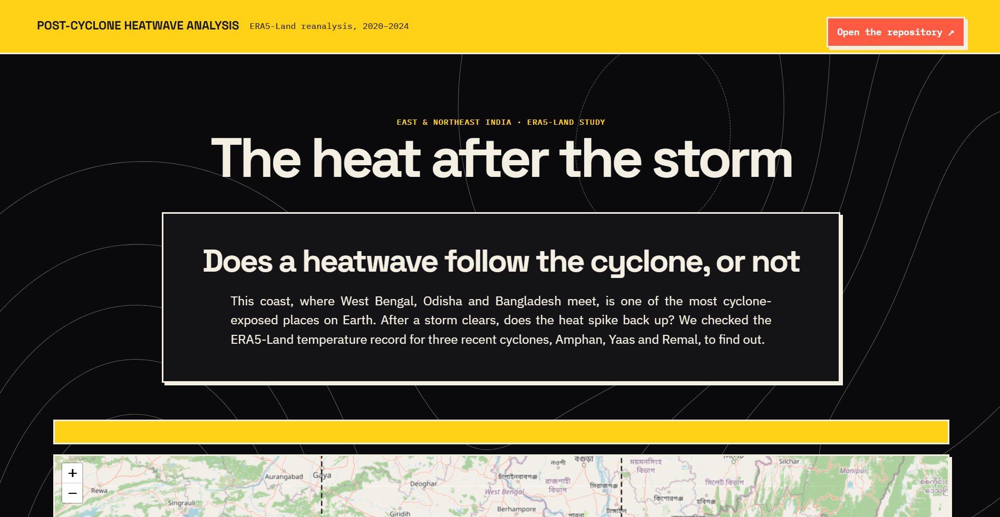

<div align="center">

# The Heat After the Storm

### Post-Cyclone Heatwave Analysis over East & Northeast India

[](LICENSE)
[](https://www.python.org/)
[](notebooks/Session1_TeamNakshamitra_SPARK2.ipynb)
[](https://cds.climate.copernicus.eu/datasets/reanalysis-era5-land)
[](https://www.grss-ieee.org/event/spark-2-0/)

*Does the heat come back after a cyclone leaves? An ERA5-Land reanalysis study of Amphan, Yaas and Remal, built by Team Nakshamitra.*

</div>

<br>

<div align="center">
  
  <sub><a href="https://vaibhavnagare-gis.github.io/Post-Cyclone-Heatwave-Analysis/">Live site</a>, interactive study area map, real-time charts and the full story from problem to verdict.</sub>
</div>

<br>

## Table of contents

- [Overview](#overview)
- [Live site](#live-site)
- [The honest answer](#the-honest-answer)
- [The three cyclones](#the-three-cyclones)
- [Data and methodology](#data-and-methodology)
- [Repository structure](#repository-structure)
- [Built with](#built-with)
- [Running this locally](#running-this-locally)
- [Achievement: IEEE GRSS SPARK 2.0](#achievement-ieee-grss-spark-20)
- [Acknowledgment](#acknowledgment)
- [Data sources and credits](#data-sources-and-credits)
- [License](#license)
- [Author](#author)

<br>

## Overview

Cyclones that make landfall on the West Bengal and Odisha coast are usually followed, in disaster-planning conversations, by a fear of the next hazard: a heatwave once the clouds clear and the floodwater recedes. This project tests that assumption directly against the temperature record rather than assuming it.

Using ERA5-Land reanalysis data from the Copernicus Climate Data Store, this analysis compares land surface air temperature in the 14 days before landfall against the 32 days after landfall, for three cyclones that hit the same stretch of coast between 2020 and 2024: **Amphan**, **Yaas** and **Remal**. The repository contains the full analysis notebook, the raw results, the generated figures and animations, and a small interactive website that presents the findings with a live map, live charts and an honest verdict.

<br>

## Live site

The `index.html` in this repository is a static, dependency-free website (HTML, CSS and vanilla JavaScript, plus Leaflet and Chart.js from a CDN) that presents the analysis end to end.

> Live demo: **[vaibhavnagare-gis.github.io/Post-Cyclone-Heatwave-Analysis](https://vaibhavnagare-gis.github.io/Post-Cyclone-Heatwave-Analysis/)**

<br>

## The honest answer

The starting hypothesis was that clearer skies and drier ground after a cyclone would push temperatures up. That is not what the data shows for two of the three cyclones.

| Cyclone | Temperature change | Result |
|---|---|---|
| Amphan | −1.29 °C | Cooled, statistically significant |
| Yaas | −1.85 °C | Cooled, statistically significant |
| Remal | +0.55 °C | Warmed, statistically significant |

Two of three cyclones cooled the region rather than warming it, enough to reject a general post-cyclone warming pattern for this stretch of coast. At the same time, the share of days that counted as local heatwave days ran well above the 5% expected by chance for all three cyclones, including the two that cooled on average. Average cooling and sharp local heat spikes are not a contradiction, both can happen in the same post-cyclone window, and that overlap is the part of this analysis most worth following up on.

<br>

## The three cyclones

| | Amphan | Yaas | Remal |
|---|---|---|---|
| Category | Super Cyclonic Storm | Very Severe Cyclonic Storm | Severe Cyclonic Storm |
| Landfall | 20 May 2020 | 26 May 2021 | 27 May 2024 |
| Landfall coordinates | 21.6°N, 88.2°E | 21.7°N, 87.0°E | 22.4°N, 88.8°E |
| Landfall zone | Odisha / West Bengal coast | Odisha coast | West Bengal coast |
| Pre-cyclone window | 06–19 May 2020 | 12–25 May 2021 | 13–26 May 2024 |
| Pre-cyclone avg temp | 30.46 °C | 30.62 °C | 32.38 °C |
| Post-cyclone avg temp | 29.17 °C | 28.78 °C | 32.93 °C |
| Change | −1.29 °C | −1.85 °C | +0.55 °C |
| p-value | < 0.001 | < 0.001 | 6.25 × 10⁻¹⁸¹ |
| Cohen's d | −0.474 | −0.677 | 0.176 |
| Heatwave days | 13 / 32 (40.6%) | 5 / 32 (15.6%) | 27 / 32 (84.4%) |

Amphan was reported at roughly 128 deaths and about $13 billion in damage across India, the costliest cyclone on record for the North Indian Ocean at the time. Yaas caused widespread coastal and inland flooding along the Odisha coast. Remal's rain band reached furthest, with heavy rainfall extending into Northeast India as far as Assam.

<br>

## Data and methodology

All numbers on this page and in the linked notebook come from **ERA5-Land hourly reanalysis** (2 m air temperature), sourced through the **Copernicus Climate Data Store**, for the study area **17°N–27°N, 85°E–90°E** covering East and Northeast India.

1. **Pick a before and after.** For each cyclone, the 14 days immediately before landfall form the pre-cyclone window, and the 32 days immediately after landfall form the post-cyclone window.
2. **Compare the two.** Every grid cell, every day, in both windows is pooled and run through an independent two-sample t-test to check whether the mean temperature actually shifted.
3. **Size the shift.** Cohen's d converts the raw temperature change into a standardized effect size, so a large shift over a noisy baseline can be told apart from a small, precise one.
4. **Flag the extremes.** A day counts as a heatwave day if the region's spatial maximum temperature that day exceeds the 95th percentile of pre-cyclone daily maximum temperatures. By chance alone, this should happen on about 5% of post-cyclone days.

The full working, including data download, the statistical tests and the figure generation, is in [`notebooks/Session1_TeamNakshamitra_SPARK2.ipynb`](notebooks/Session1_TeamNakshamitra_SPARK2.ipynb). The final numeric results are in [`data/results/cyclone_heatwave_results.csv`](data/results/cyclone_heatwave_results.csv).

> **Note:** if you are working from the notebook directly, make sure you are not committing a live Copernicus CDS API key to a public branch. Store credentials in a local `.cdsapirc` file or an environment variable instead of hardcoding them in the notebook.

<br>

## Repository structure

```
Post-Cyclone-Heatwave-Analysis/
├── assets/
│   ├── contour-bg.svg                     # decorative background used by index.html
│   └── Webpage_Snapshot.png                # website screenshot, used in this README
├── data/
│   └── results/
│       └── cyclone_heatwave_results.csv   # final per-cyclone results
├── docs/
│   └── Session1_TeamNakshamitra_SPARK2.pptx  # competition slide deck
├── notebooks/
│   └── Session1_TeamNakshamitra_SPARK2.ipynb # full analysis notebook
├── visualizations/
│   ├── animations/
│   │   ├── Amphan_animation.gif
│   │   ├── Yaas_animation.gif
│   │   └── Remal_animation.gif
│   ├── anomaly_maps.png                   # post-cyclone temperature anomaly, all three cyclones
│   ├── study_area_map.png                 # cyclone landfall zones and buffers
│   └── summary_charts.png                 # temperature change, heatwave days, effect size
├── index.html                             # the website
├── styles.css
├── script.js
├── LICENSE
└── README.md
```

<br>

## Built with

**Analysis**


**Website**


No build step and no framework, `index.html`, `styles.css` and `script.js` are hand-written and dependency-free apart from the three CDN libraries above.

<br>

## Running this locally

**The website**

```bash
git clone https://github.com/VaibhavNagare-GIS/Post-Cyclone-Heatwave-Analysis.git
cd Post-Cyclone-Heatwave-Analysis
python -m http.server 8000
```

Then open `http://localhost:8000` in a browser. A local server is required because the page fetches `data/results/cyclone_heatwave_results.csv` at runtime, and that fetch does not work reliably from a plain `file://` path.

**The notebook**

```bash
pip install numpy scipy matplotlib cartopy h5py pandas jupyter cdsapi
jupyter notebook notebooks/Session1_TeamNakshamitra_SPARK2.ipynb
```

You will need your own Copernicus Climate Data Store account and API key to re-download the ERA5-Land data. Register at [cds.climate.copernicus.eu](https://cds.climate.copernicus.eu/).

<br>

## Achievement: IEEE GRSS SPARK 2.0

🏆 **Winner, Team Nakshamitra**

This analysis was built for **SPARK 2.0**, an online ideathon run by the **IEEE Geoscience and Remote Sensing Society (GRSS)**, under Problem Statement 4: Post-Cyclone Heatwave Analysis. Team Nakshamitra's submission, this study of Amphan, Yaas and Remal using ERA5-Land reanalysis data, won the competition.

SPARK 2.0 focused on compound disaster risk across Eastern and Northeastern India, where multiple hazards interacting (like a cyclone followed by a heat spell) can cause more damage than either hazard alone. The workshop encouraged participants to use free, open-source geospatial tools and open Earth Observation data to analyze and communicate that risk for local planning and disaster preparedness. It was sponsored by the Data Science for Climate Risk Management program at Birla Institute of Technology-Mesra.

<br>

## Acknowledgment

This project was built together with **Barnali Bhowmik**, a classmate from the MSc Geoinformatics program. From the data pull through the final analysis, this was teamwork, and the win belongs to both of us. Thank you, Barnali, for the hours and the collaboration that got us here.

<br>

## Data sources and credits

- [ERA5-Land hourly reanalysis](https://cds.climate.copernicus.eu/datasets/reanalysis-era5-land), Copernicus Climate Data Store, 2 m temperature, the core dataset behind every number in this repository
- [IEEE GRSS SPARK 2.0](https://www.grss-ieee.org/event/spark-2-0/), the event this project was built for
- Basemap tiles: standard [OpenStreetMap](https://www.openstreetmap.org/copyright) raster tiles, © OpenStreetMap contributors
- [Leaflet](https://leafletjs.com/), [Chart.js](https://www.chartjs.org/) and [Papa Parse](https://www.papaparse.com/), used in the website

<br>

## License

This project is licensed under the **MIT License**, see [`LICENSE`](LICENSE) for the full text.

<br>

## Author

<div align="left">

**Vaibhav Shivaji Nagare**

[](https://github.com/VaibhavNagare-GIS)
[](https://www.linkedin.com/in/vaibhav-nagare-gis)
[](https://github.com/VaibhavNagare-GIS/Post-Cyclone-Heatwave-Analysis)

</div>
